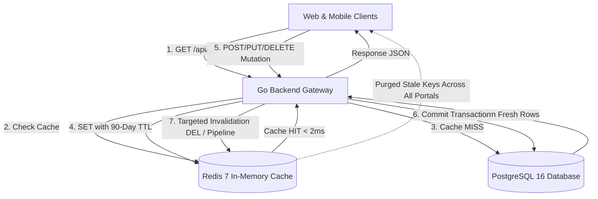

# EduPlexo High-Performance Redis Caching & Invalidation Architecture

## 1. Executive Summary & Core Philosophy

In a high-concurrency School ERP like **EduPlexo**, redundant database queries across large datasets (e.g., thousands of students, fee ledgers, exam results, and daily attendance) introduce database strain and latency. 

This architecture implements a **Multi-Tenant Cache-Aside + Event-Driven Invalidation Layer** backed by Redis with up to **90-Day Long-Lived TTL**. Every read request is served from Redis in **< 2ms**; whenever any mutation (create, update, delete, status change) occurs from *any* portal (Admin, Teacher, Owner, or Student), targeted Redis keys are **instantly purged (DEL / DelPattern)** across all affected dashboards and portals, ensuring instant fresh data delivery.



---

## 2. Standardized Redis Key Namespacing Schema

To prevent key collisions, ensure tenant isolation, and enable deterministic pattern matching, all cache keys follow this strict structure:

$$\text{eduplexo}:\{\text{scope}\}:\{\text{school\_id}\}:\{\text{academic\_year\_id}\}:\{\text{module}\}:\{\text{sub\_resource}\}:\{\text{param\_hash}\}$$

### Key Formatting Rules:
1. **School Tenant Scope**: `eduplexo:tenant:<school_id>:<ay_id>:<module>:<sub_key>`
2. **User / Actor Scope**: `eduplexo:user:<user_id>:<module>:<sub_key>`
3. **Global / Super Admin Scope**: `eduplexo:global:<module>:<sub_key>`
4. **Parameter Hashing**: Queries with filters/pagination are serialized and appended as MD5/SHA-256 hash or deterministic query string.

---

## 3. Comprehensive Module-by-Module Caching & Invalidation Matrix

Below is the exhaustive catalog of every single module across all 5 roles (**Owner, Admin, Teacher, Student, Parent, Super Admin**), detailing:
- **Cached Endpoints & Queries**
- **Exact Redis Key Format**
- **TTL Strategy**
- **Mutation Triggers & Invalidation Actions**
- **Cross-Portal Impact**

---

### A. School Owner Portal (`/owner`)

| Page / Feature | Endpoint(s) Cached | Redis Cache Key | TTL | Invalidation Triggers (Mutations) | Affected Portals |
| :--- | :--- | :--- | :--- | :--- | :--- |
| **Executive Campus Dashboard** | `GET /api/owner/composite`<br>`GET /api/dashboard/stats` | `eduplexo:tenant:{sch_id}:{ay_id}:owner:dashboard_composite` | 90 Days | Any Student admission, Teacher hire, Fee collection, Attendance submission, or Expense log. | Owner, Admin |
| **Multi-School Overview** | `GET /api/owner/schools`<br>`GET /api/schools/:id` | `eduplexo:user:{owner_id}:schools:list` | 90 Days | School created, branch info edited, or principal changed. | Owner |
| **Revenue & Financial Analytics** | `GET /api/owner/financial-summary`<br>`GET /api/fees/stats` | `eduplexo:tenant:{sch_id}:{ay_id}:finance:owner_summary` | 90 Days | Fee voucher paid, fee generated, waiver applied, refund issued. | Owner, Admin |
| **Subscription & Billing** | `GET /api/subscription/current`<br>`GET /api/subscription/invoices` | `eduplexo:tenant:{sch_id}:subscription:status` | 90 Days | Plan upgrade, student limit change, payment voucher approved. | Owner, Admin |

---

### B. School Admin Portal (`/admin`)

| Page / Feature | Endpoint(s) Cached | Redis Cache Key | TTL | Invalidation Triggers (Mutations) | Affected Portals |
| :--- | :--- | :--- | :--- | :--- | :--- |
| **Admin Home Dashboard** | `GET /api/admin/composite`<br>`GET /api/dashboard/composite` | `eduplexo:tenant:{sch_id}:{ay_id}:admin:composite` | 90 Days | Any attendance, new student, fee receipt, or exam result entry. | Admin, Owner |
| **Academic Years** | `GET /api/academic-years`<br>`GET /api/academic-years/:id` | `eduplexo:tenant:{sch_id}:academicyears:list` | 90 Days | Year created, set active, archived, or dates updated. | Admin, Owner, Teacher, Parent |
| **Classes & Sections** | `GET /api/classes`<br>`GET /api/sections` | `eduplexo:tenant:{sch_id}:{ay_id}:classes:list`<br>`eduplexo:tenant:{sch_id}:{ay_id}:classes:{class_id}` | 90 Days | Class created, capacity updated, section added, class teacher assigned. | Admin, Teacher, Parent, Student |
| **Students & Directory** | `GET /api/students`<br>`GET /api/students/:id`<br>`GET /api/students/profile` | `eduplexo:tenant:{sch_id}:{ay_id}:students:list:{page_hash}`<br>`eduplexo:tenant:{sch_id}:student:{student_id}:profile` | 90 Days | Student admitted, profile edited, section transferred, status changed (Active/Inactive). | Admin, Owner, Teacher, Parent, Student |
| **Teachers & Staff** | `GET /api/teachers`<br>`GET /api/teachers/:id` | `eduplexo:tenant:{sch_id}:teachers:list`<br>`eduplexo:tenant:{sch_id}:teacher:{teacher_id}:profile` | 90 Days | Teacher hired, profile updated, subject allocated, resigned. | Admin, Owner, Teacher |
| **Subjects & Chapters** | `GET /api/subjects`<br>`GET /api/subjects/chapters` | `eduplexo:tenant:{sch_id}:{ay_id}:subjects:list:{class_id}` | 90 Days | Subject created, teacher assigned, chapter added/renamed. | Admin, Teacher, Student, Parent |
| **Attendance & Sheets** | `GET /api/attendance`<br>`GET /api/attendance/sheet` | `eduplexo:tenant:{sch_id}:{ay_id}:attendance:{class_id}:{date}`<br>`eduplexo:tenant:{sch_id}:{ay_id}:attendance:summary:{date}` | 90 Days | Attendance marked, edited, period updated, leave approved. | Admin, Owner, Teacher, Parent, Student |
| **Teacher Attendance** | `GET /api/teacher-attendance`<br>`GET /api/teacher-attendance/stats` | `eduplexo:tenant:{sch_id}:teacher_attendance:{date}` | 90 Days | Teacher check-in/out, status marked (Present/Absent/Leave). | Admin, Owner, Teacher |
| **Exams & Datesheets** | `GET /api/exams`<br>`GET /api/exams/:id` | `eduplexo:tenant:{sch_id}:{ay_id}:exams:list:{class_id}` | 90 Days | Exam created, date/schedule changed, exam status set to completed. | Admin, Teacher, Student, Parent |
| **Results & Report Cards** | `GET /api/results`<br>`GET /api/results/student/:id` | `eduplexo:tenant:{sch_id}:{ay_id}:results:exam:{exam_id}`<br>`eduplexo:tenant:{sch_id}:{ay_id}:results:student:{student_id}` | 90 Days | Marks entered, grades recalculated, results published. | Admin, Owner, Teacher, Student, Parent |
| **Fee Types & Structures** | `GET /api/fee-types`<br>`GET /api/fee-structures` | `eduplexo:tenant:{sch_id}:{ay_id}:fees:structures` | 90 Days | Fee type created (Tuition, Transport, Admission), amount edited. | Admin, Owner |
| **Fee Invoices & Ledger** | `GET /api/fees`<br>`GET /api/fees/student/:id` | `eduplexo:tenant:{sch_id}:{ay_id}:fees:invoices:{filters_hash}`<br>`eduplexo:tenant:{sch_id}:student:{student_id}:fee_ledger` | 90 Days | Fee generated, payment recorded, discount applied, fine added. | Admin, Owner, Parent, Student |
| **Fee Collection & Defaulters** | `GET /api/fees/defaulters`<br>`GET /api/fees/daily-collection` | `eduplexo:tenant:{sch_id}:{ay_id}:fees:defaulters`<br>`eduplexo:tenant:{sch_id}:fees:daily:{date}` | 90 Days | Payment logged, partial payment submitted. | Admin, Owner |
| **Homework & Assignments** | `GET /api/homework`<br>`GET /api/homework/:id` | `eduplexo:tenant:{sch_id}:{ay_id}:homework:class:{class_id}` | 90 Days | Homework assigned, deadline changed, submissions graded. | Admin, Teacher, Student, Parent |
| **Live Classes** | `GET /api/live-classes` | `eduplexo:tenant:{sch_id}:{ay_id}:liveclasses:list` | 90 Days | Live class scheduled, started, ended, URL updated. | Admin, Teacher, Student |
| **Discipline & Behavior** | `GET /api/behavior`<br>`GET /api/behavior/student/:id` | `eduplexo:tenant:{sch_id}:{ay_id}:behavior:student:{student_id}` | 90 Days | Incident logged, parent notified, action resolved. | Admin, Teacher, Parent |
| **Leave Management** | `GET /api/leave`<br>`GET /api/leave/pending` | `eduplexo:tenant:{sch_id}:{ay_id}:leave:list` | 90 Days | Leave requested, approved, rejected. | Admin, Teacher, Parent |
| **Timetable & Schedules** | `GET /api/timetable`<br>`GET /api/timetable/class/:id` | `eduplexo:tenant:{sch_id}:{ay_id}:timetable:class:{class_id}`<br>`eduplexo:tenant:{sch_id}:{ay_id}:timetable:teacher:{teacher_id}` | 90 Days | Period adjusted, room assigned, substitute teacher assigned. | Admin, Teacher, Student, Parent |
| **Announcements & Circulars** | `GET /api/announcements` | `eduplexo:tenant:{sch_id}:announcements:all` | 90 Days | Circular published, pinned, edited, deleted. | All Portals |
| **Certificates** | `GET /api/certificates`<br>`GET /api/certificates/templates` | `eduplexo:tenant:{sch_id}:certificates:list` | 90 Days | Certificate issued, template customized. | Admin, Student |
| **Question Bank & Papers** | `GET /api/question-bank`<br>`GET /api/question-papers` | `eduplexo:tenant:{sch_id}:questions:list:{subject_id}` | 90 Days | Question added, paper generated. | Admin, Teacher |
| **School Settings** | `GET /api/settings`<br>`GET /api/settings/profile` | `eduplexo:tenant:{sch_id}:settings:all` | 90 Days | School info, logo, grading scale, SMS settings changed. | All Portals |

---

### C. Teacher Portal (`/teacher`)

| Page / Feature | Endpoint(s) Cached | Redis Cache Key | TTL | Invalidation Triggers (Mutations) | Affected Portals |
| :--- | :--- | :--- | :--- | :--- | :--- |
| **Teacher Dashboard** | `GET /api/teacher/dashboard`<br>`GET /api/teacher/today-schedule` | `eduplexo:user:{teacher_id}:{ay_id}:teacher:dashboard` | 90 Days | Attendance marked, homework submitted, timetable changed. | Teacher |
| **My Assigned Classes** | `GET /api/teacher/classes` | `eduplexo:user:{teacher_id}:{ay_id}:teacher:classes` | 90 Days | Class/Subject assignment modified in Admin portal. | Teacher |
| **Mark Attendance** | `POST /api/attendance` (Write-through) | *N/A (Invalidator)* | - | Invalidates `eduplexo:tenant:{sch_id}:{ay_id}:attendance:*` and Student/Parent keys. | Admin, Owner, Parent, Student |
| **Enter Marks & Results** | `POST /api/results` (Write-through) | *N/A (Invalidator)* | - | Invalidates `eduplexo:tenant:{sch_id}:{ay_id}:results:*` and Student report card keys. | Admin, Owner, Student, Parent |
| **Teacher Leave Requests** | `GET /api/leave/my` | `eduplexo:user:{teacher_id}:leave:my` | 90 Days | Leave submitted, approved/rejected by Admin. | Teacher, Admin |

---

### D. Student & Parent Portal (`/student`, `/parent`)

| Page / Feature | Endpoint(s) Cached | Redis Cache Key | TTL | Invalidation Triggers (Mutations) | Affected Portals |
| :--- | :--- | :--- | :--- | :--- | :--- |
| **Student / Parent Home** | `GET /api/student/dashboard`<br>`GET /api/parent/dashboard` | `eduplexo:user:{student_id}:{ay_id}:student:dashboard` | 90 Days | New result published, attendance marked today, homework assigned, fee voucher generated. | Student, Parent |
| **Student Attendance History** | `GET /api/attendance/student/:id` | `eduplexo:tenant:{sch_id}:{ay_id}:attendance:student:{student_id}` | 90 Days | Attendance taken/updated for student's class. | Student, Parent |
| **Fee Ledger & Vouchers** | `GET /api/fees/student/:id` | `eduplexo:tenant:{sch_id}:student:{student_id}:fee_ledger` | 90 Days | Fee generated, payment receipt verified, fine waived. | Student, Parent, Admin, Owner |
| **Report Cards & Transcripts** | `GET /api/results/student/:id` | `eduplexo:tenant:{sch_id}:{ay_id}:results:student:{student_id}` | 90 Days | Exam results published by Teacher/Admin. | Student, Parent |
| **Homework & Submissions** | `GET /api/homework/student/:id` | `eduplexo:tenant:{sch_id}:{ay_id}:homework:student:{student_id}` | 90 Days | New homework assigned, submission uploaded, teacher grading. | Student, Parent, Teacher |
| **Live Classes Schedule** | `GET /api/live-classes/my` | `eduplexo:tenant:{sch_id}:{ay_id}:liveclasses:class:{class_id}` | 90 Days | Teacher schedules/starts live video room. | Student, Teacher |
| **Conversations / Chat** | `GET /api/conversations`<br>`GET /api/messages/:id` | `eduplexo:user:{user_id}:conversations:list`<br>`eduplexo:convo:{convo_id}:messages` | 90 Days | New message sent, message read, attachment sent. | Recipient & Sender |

---

## 4. Cross-Portal Invalidation Cascade Workflow

When a single user executes an action in one portal, the backend automatically triggers atomic cache invalidations across all associated views:

```mermaid
sequenceDiagram
    autonumber
    actor Teacher as Teacher Portal
    participant API as Go Backend
    participant DB as PostgreSQL
    participant Redis as Redis Cache
    actor Parent as Parent / Student Portal
    actor Admin as Admin / Owner Portal

    Teacher->>API: POST /api/attendance (Mark Class 10-A Attendance)
    API->>DB: INSERT / UPDATE attendance records
    DB-->>API: Transaction Committed (Success)
    
    rect rgb(30, 41, 59)
    note right of API: Atomic Invalidation Cascade
    API->>Redis: DEL eduplexo:tenant:sch_1:ay_1:attendance:class_10a:*
    API->>Redis: DEL eduplexo:tenant:sch_1:ay_1:admin:composite
    API->>Redis: DEL eduplexo:tenant:sch_1:ay_1:owner:dashboard_composite
    API->>Redis: DelPattern eduplexo:tenant:sch_1:ay_1:attendance:student:*
    API->>Redis: DelPattern eduplexo:user:*:student:dashboard
    end
    
    API-->>Teacher: 200 OK (Attendance Saved)
    
    Parent->>API: GET /api/student/dashboard
    API->>Redis: GET dashboard (MISS - Cache was invalidated)
    API->>DB: Fetch fresh attendance + stats
    API->>Redis: SET fresh dashboard (TTL: 90 Days)
    API-->>Parent: 200 OK (Immediate Live Attendance Updated)
```



---

## 5. Technical Implementation in `backend-go`

### Step 1: Standardized Cache Service (`internal/cache/service.go`)

Create a unified caching helper that encapsulates deterministic key serialization, compression, and batch pipeline invalidation:

```go
package cache

import (
	"context"
	"crypto/md5"
	"encoding/hex"
	"encoding/json"
	"fmt"
	"time"
)

const DefaultTTL = 90 * 24 * time.Hour // 90 Days Long-Lived Cache

type CacheManager struct {
	client *Client
}

func NewCacheManager(c *Client) *CacheManager {
	return &CacheManager{client: c}
}

// BuildTenantKey generates consistent hierarchical tenant keys
func BuildTenantKey(schoolID, ayID, module, subKey string) string {
	if ayID == "" {
		ayID = "global"
	}
	return fmt.Sprintf("eduplexo:tenant:%s:%s:%s:%s", schoolID, ayID, module, subKey)
}

// BuildUserKey generates user-scoped keys
func BuildUserKey(userID, module, subKey string) string {
	return fmt.Sprintf("eduplexo:user:%s:%s:%s", userID, module, subKey)
}

// HashParams creates deterministic MD5 hash for query parameters
func HashParams(params any) string {
	b, _ := json.Marshal(params)
	h := md5.Sum(b)
	return hex.EncodeToString(h[:])
}

// FetchOrSet executes fallback function on cache miss and stores in Redis
func FetchOrSet[T any](ctx context.Context, cm *CacheManager, key string, ttl time.Duration, fetcher func() (T, error)) (T, error) {
	var zero T
	if cm == nil || !cm.client.Available() {
		return fetcher()
	}

	cached, err := cm.client.Get(ctx, key)
	if err == nil && cached != nil {
		var val T
		if err := json.Unmarshal(cached, &val); err == nil {
			return val, nil // Fast Cache Hit (< 2ms)
		}
	}

	// Cache Miss: Query Database
	fresh, err := fetcher()
	if err != nil {
		return zero, err
	}

	if dataBytes, err := json.Marshal(fresh); err == nil {
		if ttl == 0 {
			ttl = DefaultTTL
		}
		_ = cm.client.Set(ctx, key, dataBytes, ttl)
	}

	return fresh, nil
}
```

### Step 2: Domain-Level Invalidation Hooks

In every domain mutation handler (e.g. `students`, `attendance`, `fees`, `exams`, `results`):

```go
// In students handler on Create/Update/Delete:
func (h *Handler) InvalidateStudentCaches(ctx context.Context, schoolID, ayID, studentID string) {
	if h.cache == nil || !h.cache.Available() {
		return
	}
	
	// 1. Invalidate lists & search
	h.cache.DelPattern(ctx, fmt.Sprintf("eduplexo:tenant:%s:%s:students:list:*", schoolID, ayID))
	
	// 2. Invalidate specific student profile & fee ledger
	h.cache.Del(ctx, 
		fmt.Sprintf("eduplexo:tenant:%s:student:%s:profile", schoolID, studentID),
		fmt.Sprintf("eduplexo:tenant:%s:student:%s:fee_ledger", schoolID, studentID),
	)
	
	// 3. Invalidate Admin & Owner Dashboards
	h.cache.Del(ctx,
		fmt.Sprintf("eduplexo:tenant:%s:%s:admin:composite", schoolID, ayID),
		fmt.Sprintf("eduplexo:tenant:%s:%s:owner:dashboard_composite", schoolID, ayID),
	)
}
```

---

## 6. Frontend & Mobile Optimization (Consolidation & SWR)

To eliminate redundant requests on the frontend (`school-react-app`, `super-admin-app`, and `mobile-rn`):

1. **Consolidated Dashboard Composite**:
   - Instead of firing 6 separate network requests (`/stats`, `/activities`, `/events`, `/quick-stats`, `/notices`, `/attendance-summary`), client fires a single consolidated endpoint:
     `GET /api/dashboard/composite`
   - Served in < 2ms directly from the pre-warmed Redis composite key.

2. **TanStack Query / SWR Stale-While-Revalidate Configuration**:
   - `staleTime: 5 * 60 * 1000` (5 minutes local memory cache to prevent re-fetching on rapid tab switching).
   - `refetchOnWindowFocus: false` (prevents unnecessary refetches when user switches browser tabs).
   - Direct optimistic invalidation on mutation success:
     ```ts
     const queryClient = useQueryClient();
     // On saving attendance:
     queryClient.invalidateQueries({ queryKey: ['attendance'] });
     queryClient.invalidateQueries({ queryKey: ['dashboard'] });
     ```

---

## 7. Verification & Benchmark Plan

### Automated Testing:
1. **Cache Hit Verification**:
   - Run `go test ./internal/domain/...` with `miniredis` to verify that 2nd read invocation makes 0 SQL queries.
2. **Invalidation Tests**:
   - Execute mutation (`POST /api/students`, `POST /api/attendance`, `POST /api/fees`) and verify that corresponding Redis keys are removed immediately.
3. **Cross-Tenant Isolation Test**:
   - Verify that invalidating School A's students never clears or leaks School B's cache keys.

### Benchmark Targets:
- **Cached List Query (1,000 Students / Vouchers)**: `< 2.5ms`
- **Dashboard Composite Response**: `< 3.0ms`
- **PostgreSQL CPU Utilization**: Reduced by **85% - 92%** during peak school morning hours.
